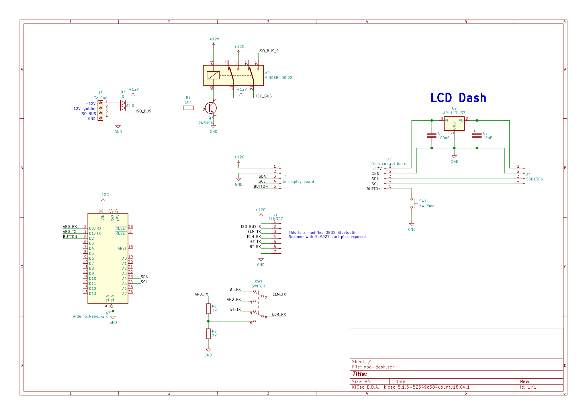
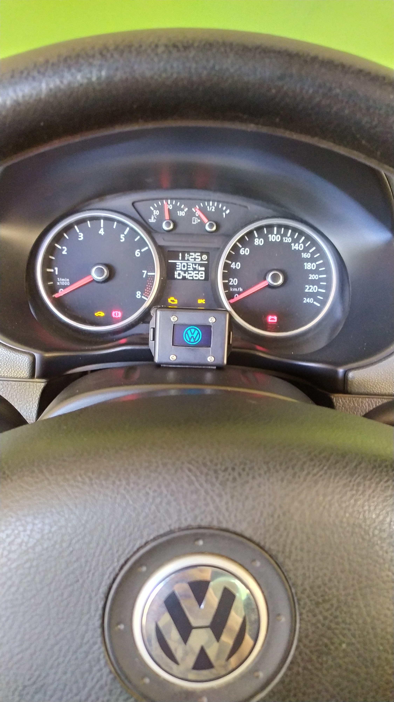
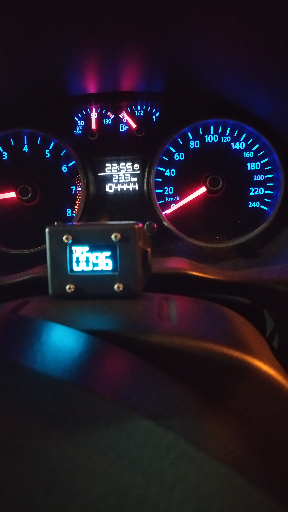

# OBD Dash display

Auxiliar display that shows some information from my car ECU through OBD ISO 9141-2 bus.

This project is based in a chinese ELM327 OBD to Bluetooth, the module was disassembled and the pcb traces between the ELM and bluetooth was cut and rewired to Arduino wich is responsible for ELM initialization and query for the ECU data.

The current ECU data displayed are:
* Battery voltage
* RPM
* MAP
* Spark advace
* Intake temperature
* Cooland temperature
* TPS

Schematic

Pictures
<table>
  <tr>
    <td></td>
    <td></td>
  </tr>
</table>

